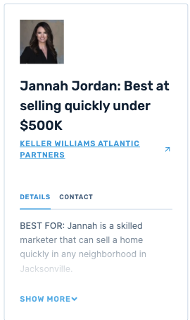
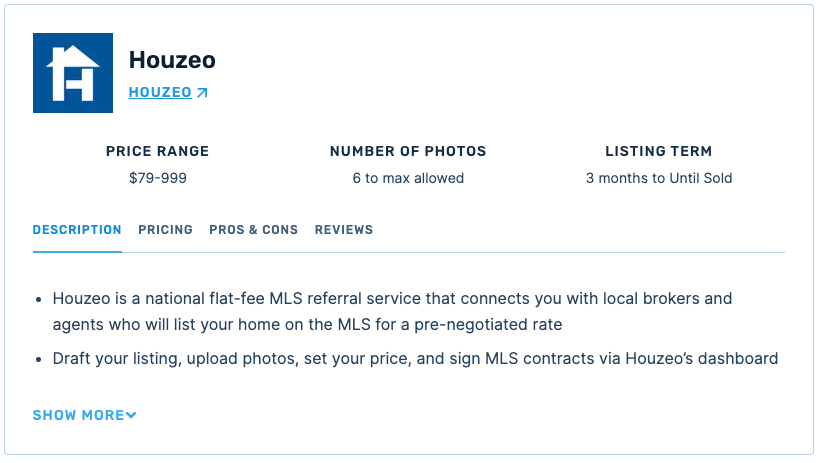

# Clever React Pair Programming Interview

## Setup
1. Fork this repository, and clone it onto your machine.
2. cd into the folder and run `npm install`
3. Run `npm run storybook` for a hot reloading development environment.

## Task
We'll be implementing the review card component from the technical spec that you put together. 

**Designs**





## API
We've put together an api that you can call for data to populate your component.

**API URL**

`GET - https://api.web.movewithcleverdev.com/staging/review-card-interview`

**Params**

`slug` - Identifier for the review you're trying to fetch

**Available Slugs**
-  `test-review-1`
-  `test-review-2`
-  `test-review-3`

**API Schema**
```javascript
{
  title,        // Required - String - Review Card Title',
  image_url,    // Optional - String - Imgix Image Link
  link: {       // Optional - Object - Link On the Review Card
    title,         // String - Display Title of Link
    url,           // String - Link URL
    isNoFollow,    // Bool - Should link be no-follow
  },
  call_outs: [  // Optional - Array - Review Card Callouts
    {
      title,       // String - Callout Title
      text,        // String - Callout Sub Text
    },
    ...
  ],
  tabs: [       // Optional - Array - Review Card Info Tabs
    {
      title,       // String - Tab Title
      content,     // String - Tab HTML Content
    },
    ...
  ],
}
```